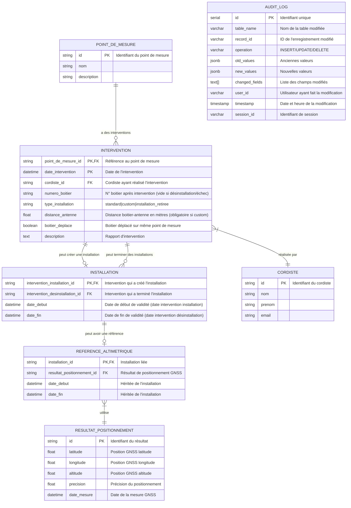

# [EPIC] Gestion V2 des points de mesures: interventions, installation, référencement alti et workflows associés

Technical lead: Rémy Lopez
Product Owner: Valentin De Fouqueau
Technical complexity: joker
Component: MORTEM
ID: VTX-US-817
Sprint: Sprint 2025-13 (https://www.notion.so/Sprint-2025-13-25a26c7cdb9a80678167dd79cf41415a?pvs=21)
created at: 19 août 2025 17:16
crée par: Rémy Lopez
Dernière modification: 2 septembre 2025 10:01
Status: Ready to plan
Priority score: JOKER

- **Executive summary 👈** déplier si vous être pressé
    
    **Contexte et Objectifs**
    
    Cet Epic vise à moderniser la gestion des points de mesure dans le centre de contrôle en introduisant trois nouveaux objets métiers essentiels : **interventions**, **installations** et **référencements altimétriques**. L'objectif est de digitaliser et automatiser les processus internes de vorteX-io pour améliorer la traçabilité et la précision des opérations terrain.
    
    **Bénéfices Attendus**
    
    - **Historisation complète** : Traçage de toutes les interventions, installations et références altimétriques avec visualisation dans le centre de contrôle
    - **Gestion temporelle précise** : Définition des références altimétriques sur des périodes délimitées par les interventions
    - **Élimination des redondances** : Suppression des biais système obsolètes au profit d'un système unifié
    - **Audit trail complet** : Traçabilité de toutes les modifications avec utilisateur, champs modifiés et horodatage
    
    **Architecture Technique**
    
    Le système s'articule autour de trois objets métiers interconnectés :
    
    1. **Intervention** : Actions terrain (installation, maintenance, désinstallation) avec cordiste, dates et rapports
    2. **Installation** : Caractéristiques physiques du déploiement avec périodes de validité
    3. **Référence altimétrique** : Positionnement GNSS précis lié aux installations
    
    Un système d'audit automatique garantit la traçabilité complète de toutes les opérations.
    
    **Workflows Automatisés**
    
    Deux workflows principaux automatisent les processus :
    
    1. **Validation d'installation** : Création automatique des objets lors de nouveaux déploiements ou remplacements
    2. **Maintenance** : Gestion des interventions d'entretien, déplacements et désinstallations
    
    **Impact Organisationnel**
    
    Cette solution bénéficiera directement aux coordinateurs techniques, chefs de projets et clients finaux en leur fournissant une vision claire et historisée des opérations terrain, tout en garantissant la conformité des processus internes.
    

L’objectif de cet Epic est d’inclure dans le centre de contrôle:

- les **objets métiers** **qui permettent de gérer un point de mesure**:
    - intervention
    - installation
    - référencement altimétrique station
- les **workflows pour la manipulation de ces objets**, reflétant les processus internes de vorteX-io

Les bénéfices attendus sont les suivants:

- historiser les interventions, les installations et les références altimétriques sur un point de mesure pour les visualiser dans le centre de contrôle et dans l’application pour nos coordinateurs techniques, chefs de projets et clients finaux.
- tracer les dates d’association et de séparation entre capteur logique et physique
- définir les références altimétriques s’appliquant sur des périodes de temps délimitées par des interventions
- relier la référence altimétrique à l’intervention
- supprimer les biais systèmes qui sont redondants avec les références altimétriques et non reliés avec les interventions

⚠️ Tous les objets métiers décrits doivent être **auditables**, c’est à dire que toute création, modification et suppression doit être tracée avec l’utilisateur associé, les champs modifiés et la date de modification.

Ci-dessous, le modèle de données simplifié. Les objets points de mesure, cordiste et résultat de positionnement sont déjà existant dans le centre de contrôle.



---

## Intervention

*En tant que **responsable du déploiement**, je dois pouvoir **créer, lister, modifier et supprimer des “interventions”** sur un point de mesure **afin de*** 

- ***tracer les actions d’installations, de remplacements de boitiers ou de maintenance de l’installation.***
- ***tracer les dates d’association et de séparation entre capteur logique et physique** sous forme d’un ****historique des interventions*

Une intervention est un objet métier caractérisé par les champs suivants:

- **point de mesure** associé ou capteur logique (obligatoire, clé primaire)
- **date d’intervention** (obligatoire, clé primaire)
- **cordiste** (obligatoire)
- **n° boitier présent avant intervention** (vide en cas de 1ère installation)
- **n° boitier présent après intervention** (vide en cas de désinstallation ou si l’intervention a échouée)
- **Type d’installation après intervention (obligatoire)**: “standard” sur bras de déport ou “custom” ou “installation retirée”
- **Distance entre le boitier et l’antenne** (en mètre), positive si l’antenne est au dessus de la station. Ne devrait être modifié qu’en cas d’erreur lors de la création. ⚠️ Contrainte: obligatoire si installation *custom*
- **Boitier déplacé** après intervention tout en restant sur le même point de mesure ? oui/non (obligatoire si n° de boitier présent)
- **Description, rapport d’invervention…**

## Installation

*En tant que **responsable du déploiement**, je dois pouvoir **créer, lister, modifier et supprimer des “installations”** afin de permettre:*

- *de caractériser l’installation physique de la microstation*
- *le **référencement précis** de la station*

Une **installation** est un objet métier qui liste les caractéristiques de l’installation physique d’un boitier station sur son point de mesure avec les champs suivants:

- **Intervention d’installation liée** (obligatoire, clé primaire) pour retrouver notamment
    - la date de début de validité de l’installation qui est la date d’intervention
    - le point de mesure
    - le boitier associé au capteur physique. ⚠️ Contrainte: on ne peut associer que des interventions avec le champ “boitier ****après intervention” non vide.
    - le type d’installation
- **Intervention de désinstallation** ou de modification d’installation (facultatif) pour retrouver notamment **la date de fin de validité** de l’installation. Une intervention vide signifie que l’installation est valable sans date limite. Ce champ est modifié si le boitier est retiré (n° boitier vide après intervention) ou déplacé lors de l’intervention correspondante tout en étant sur le même point de mesure.

Les dates de début et de fin définissent la période de validité de l’installation. **Pour une même intervention d’installation, il ne peut pas y avoir d’autres installations dont les périodes de validité se chevauchent.**

Pour un même point de mesure (capteur logique), il peut exister 0, 1 ou plusieurs installations :

- **aucune** installation si le point de mesure a été identifié sans boitier installé
- **une seule** installation si le point de mesure a été équipé avec un seul boitier toujours installé. Dans ce cas, la date de fin peut être laissée vide pour indiquer que l’installation est valide sans limite de temps.
- **plusieurs** installations si:
    - le boitier à été changé (rappel: il fait indirectement partie de la clé primaire de l’installation)
    - l’antenne a été déplacée

Dans ce dernier cas, seule l’installation avec la date de validité la plus récente peut avoir une date de fin de validité non nulle.

## Référencement altimétrique

*En tant que responsable pour la surveillance du parc, je dois pouvoir **créer, lister, modifier et supprimer des “références altimétriques”** afin de fournir une hauteur d’eau dans un référentiel absolu.*

Une **installation** est un objet métier qui caractérisé par les champs suivants:

- une **installation** liée (obligatoire, clé primaire) pour retrouver notamment:
    - la période de validité de la référence altimétrique
    - le delta antenne
- le **résultat** d’une requête de positionnement avec la position GNSS de l’antenne (obligatoire, objet déjà existant)

De facto, la référence altimétrique ne s’applique sur la série temporelle qu’entre les dates de début et de fin de validité de l’installation.

## Biais système

Cet objet déjà existant est **déprécié***.*

## Log d’audit

*En tant que responsable des processus, je dois pouvoir **consulter tous les historiques de modifications des objets** en cas d’audit de nos processus et d’investigations par les équipes techniques.*

Cela se traduit par la création d’un journal d’audit avec les champs suivants:

- **table**
- **identifiant** de record
- **type d’opération** de modification
- **anciennes valeurs**
- **nouvelles valeurs**
- **liste des champs modifiés**
- **utilisateur** responsable de la modification
- **date** de modification

---

## Workflows de travail

Les workflows sont des suites d’actions automatiques créant et manipulant les objets métiers pour éviter des erreurs humaines.

### **Workflow: validation d’installation en cas de nouveau point de mesure ou de remplacement de boitier**

*En tant que responsable du déploiement, je dois pouvoir **créer automatiquement les objets intervention, installation et position de référence en cas de validation d’une installation** afin faciliter le suivi du processus d’ouverture de service, le traçage des interventions et le référencement altimétrique précis de la station.*

Ce workflow se déclenche lors de l‘utilisation de l’outil de validation d’installation pour

- la création d’un nouveau point de mesure incluant l’installation d’un nouveau boitier
- le remplacement d’un boitier sur un point de mesure existant

Lors de la validation d’une installation, un certain nombre d’actions automatique se produisent.

| **Résultat de validation**                | **Nouveau point de mesure**                                                                                                                                         | **Point de mesure existant**                                                                                                                                                                                                                  |
|-------------------------------------------|---------------------------------------------------------------------------------------------------------------------------------------------------------------------|-----------------------------------------------------------------------------------------------------------------------------------------------------------------------------------------------------------------------------------------------|
| **Intervention d’installation validée**   | - Création d’une intervention avec les champs remplis sur la base des données de la validation<br>- Création d’une nouvelle installation liée<br>- Création d’une requête de positionnement avec comme date de début d’intégration la date d’installation<br>- Création d’une position de référence une fois la requête exécutée | - Création d’une intervention avec les champs remplis sur la base des données de la validation<br>- Mise à jour de l'installation avec intervention de désinstallation<br>- Création d’une nouvelle installation<br>- Création d’une requête de positionnement avec comme date de début d’intégration la date d’installation<br>- Création d’une position de référence une fois la requête exécutée |
| **Installation invalidée**                | - Création d’une intervention avec boitier vide                                                                                                                     | - Création d’une intervention avec boitier vide et description adéquate<br>- Mise à jour de l'installation existante avec l’intervention de désinstallation si vide                                                                           |
- **Diagramme de séquence (généré par IA)**
    
    ```mermaid
    sequenceDiagram
        participant U as Utilisateur
        participant OV as Outil de Validation
        participant WF as Workflow Validation
        participant DB as Base de Données
        participant POS as Service Positionnement
        
        U->>OV: Utilise l'outil de validation
        OV->>WF: Déclenche validation d'installation
        
        alt Nouveau point de mesure
            WF->>DB: Vérifier si point de mesure existe
            DB-->>WF: Point de mesure inexistant
            
            alt Installation validée
                WF->>DB: Créer nouveau point de mesure
                WF->>DB: Créer intervention (champs remplis)
                WF->>DB: Créer nouvelle installation liée à l'intervention
                WF->>POS: Créer requête de positionnement GNSS
                Note over POS: Date début = date d'installation
                POS-->>WF: Requête de positionnement créée
                
                alt Requête de positionnement exécutée avec succès
                    POS->>DB: Créer résultat de positionnement
                    WF->>DB: Créer référence altimétrique liée à l'installation
                    WF-->>OV: Installation créée avec référence altimétrique
                else Échec du positionnement
                    WF-->>OV: Installation créée, référence altimétrique en attente
                end
                
            else Installation invalidée
                WF->>DB: Créer nouveau point de mesure
                WF->>DB: Créer intervention (n° boitier après intervention vide)
                Note over DB: Description = "Installation échouée"
                WF-->>OV: Installation échouée, intervention tracée
            end
            
        else Point de mesure existant
            WF->>DB: Vérifier si point de mesure existe
            DB-->>WF: Point de mesure existant
            WF->>DB: Récupérer installation actuelle active
            DB-->>WF: Installation actuelle (si existe)
            
            alt Installation validée (remplacement)
                WF->>DB: Créer intervention (champs remplis)
                
                opt Installation existante sans date de fin
                    WF->>DB: Mettre à jour installation existante
                    Note over DB: intervention_desinstallation_id = nouvelle intervention
                    Note over DB: date_fin = date de la nouvelle intervention
                end
                
                WF->>DB: Créer nouvelle installation liée à la nouvelle intervention
                WF->>POS: Créer requête de positionnement GNSS
                Note over POS: Date début = date d'installation
                POS-->>WF: Requête de positionnement créée
                
                alt Requête de positionnement exécutée avec succès
                    POS->>DB: Créer résultat de positionnement
                    WF->>DB: Créer référence altimétrique liée à la nouvelle installation
                    WF-->>OV: Remplacement effectué avec référence altimétrique
                else Échec du positionnement
                    WF-->>OV: Remplacement effectué, référence altimétrique en attente
                end
                
            else Installation invalidée (échec remplacement)
                WF->>DB: Créer intervention (n° boitier après intervention vide)
                Note over DB: Description = "Tentative de remplacement échouée"
                
                opt Installation existante sans intervention de désinstallation
                    WF->>DB: Mettre à jour installation existante
                    Note over DB: intervention_desinstallation_id = intervention échouée
                    Note over DB: date_fin = date de l'intervention échouée
                end
                
                WF-->>OV: Installation échouée, intervention tracée
            end
        end
        
        OV-->>U: Retourner résultat de validation
        
        Note over DB: Toutes les opérations sont tracées dans AUDIT_LOG
    ```
    

### **Workflow: Maintenance de l’installation**

*En tant que responsable du déploiement, je dois pouvoir **créer automatiquement les objets intervention, installation et position de référence en cas de maintenance d’une installation existante** afin faciliter le traçage des interventions et le référencement altimétrique précis de la station.*

Ce workflow se déclenche depuis la page intervention ou directement du point de mesure avec un bouton “Maintenance”

| Cas                                                                 | Actions                                                                                                                                                                                                                                 |
|---------------------------------------------------------------------|-----------------------------------------------------------------------------------------------------------------------------------------------------------------------------------------------------------------------------------------|
| Entretien et nettoyage de l’installation sans aucune modification de la configuration d’intervention | - Création d’une intervention                                                                                                                                                                                                          |
| Déplacement d’un élément de l’installation (boîtier et/ou antenne)  | - Création d’une intervention<br>- Mise à jour de l'installation avec intervention de désinstallation<br>- Création d’une nouvelle installation<br>- Création d’une requête de positionnement avec comme date de début d’intégration la date d’installation<br>- Création d’une position de référence une fois la requête exécutée |
| Désinstallation du boîtier                                          | - Création d’une intervention<br>- Mise à jour de l'installation avec intervention de désinstallation                                                                                                                                   |
- **Diagramme de séquence (généré par IA)**
    
    ```mermaid
    sequenceDiagram
        participant U as Utilisateur
        participant UI as Interface (Page Intervention/Point de mesure)
        participant WF as Workflow Maintenance
        participant DB as Base de Données
        participant POS as Service Positionnement
        
        U->>UI: Clic sur bouton "Maintenance"
        UI->>U: Afficher formulaire de maintenance
        U->>UI: Saisir détails de l'intervention
        Note over U,UI: Type maintenance, description, boîtier déplacé, etc.
        UI->>WF: Déclencher workflow maintenance
        
        WF->>DB: Récupérer installation active du point de mesure
        DB-->>WF: Installation actuelle (si existe)
        
        alt Entretien sans modification configuration
            Note over U,WF: Nettoyage, vérification, pas de déplacement
            
            WF->>DB: Créer intervention de maintenance
            Note over DB: boitier_deplace = false
            Note over DB: numero_boitier = même qu'avant
            Note over DB: type_installation = inchangé
            WF-->>UI: Maintenance tracée avec succès
            
        else Déplacement d'éléments (boîtier et/ou antenne)
            Note over U,WF: Modification position boîtier/antenne
            
            WF->>DB: Créer intervention de maintenance
            Note over DB: boitier_deplace = true OU distance_antenne modifiée
            
            opt Installation existante active
                WF->>DB: Mettre à jour installation existante
                Note over DB: intervention_desinstallation_id = intervention maintenance
                Note over DB: date_fin = date intervention maintenance
            end
            
            WF->>DB: Créer nouvelle installation
            Note over DB: intervention_installation_id = intervention maintenance
            Note over DB: date_debut = date intervention maintenance
            Note over DB: date_fin = null (installation active)
            
            WF->>POS: Créer requête de positionnement GNSS
            Note over POS: Date début = date maintenance
            POS-->>WF: Requête de positionnement créée
            
            alt Requête de positionnement exécutée avec succès
                POS->>DB: Créer nouveau résultat de positionnement
                WF->>DB: Créer nouvelle référence altimétrique
                Note over DB: Liée à la nouvelle installation
                WF-->>UI: Maintenance avec repositionnement réussie
            else Échec du positionnement
                WF-->>UI: Maintenance effectuée, référence altimétrique en attente
            end
            
        else Désinstallation du boîtier
            Note over U,WF: Retrait complet du boîtier
            
            WF->>DB: Créer intervention de désinstallation
            Note over DB: numero_boitier après intervention = vide
            Note over DB: type_installation = "installation_retiree"
            
            opt Installation existante active
                WF->>DB: Mettre à jour installation existante
                Note over DB: intervention_desinstallation_id = intervention désinstallation
                Note over DB: date_fin = date intervention désinstallation
            end
            
            WF-->>UI: Désinstallation tracée avec succès
            
        else Échec de maintenance
            Note over U,WF: Intervention échouée ou incomplète
            
            WF->>DB: Créer intervention d'échec
            Note over DB: Description = détails de l'échec
            Note over DB: Champs selon la situation
            
            opt Si tentative de désinstallation échouée
                Note over WF,DB: Installation reste active
            end
            
            WF-->>UI: Échec de maintenance tracé
        end
        
        UI-->>U: Afficher résultat de la maintenance
        
        Note over DB: Toutes les opérations sont tracées dans AUDIT_LOG
        
        opt Notifications
            WF->>UI: Envoyer notification aux équipes concernées
            UI-->>U: Afficher notification de succès/échec
        end
    ```