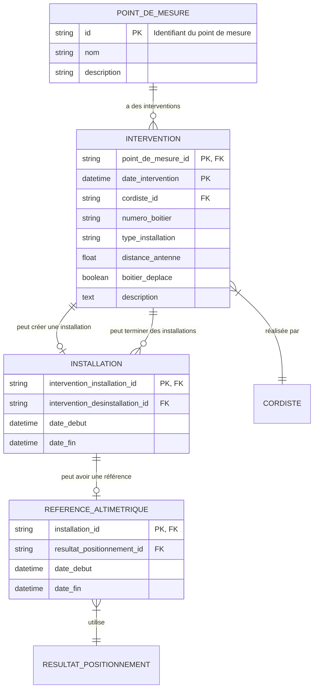

Voici une version beaucoup plus simple du diagramme :


## Modèle de données simplifié

```
POINT_DE_MESURE ──────(1:n)────── INTERVENTION
                                       │
                                    (1:1)
                                       │
                                  INSTALLATION
                                       │
                                    (1:1)
                                       │
                              REFERENCE_ALTIMETRIQUE
                                       │
                                    (n:1)
                                       │
                              RESULTAT_POSITIONNEMENT

         CORDISTE ──────(1:n)────── INTERVENTION
```

### Relations principales
- **1 Point de mesure** a **plusieurs Interventions**
- **1 Intervention** peut créer **1 Installation**  
- **1 Installation** a **1 Référence altimétrique**
- **1 Cordiste** réalise **plusieurs Interventions**

### Audit automatique sur tous les objets ✅

---
```

Cette version est beaucoup plus lisible et se concentre sur les relations essentielles sans détailler les champs. Ça vous convient mieux ?